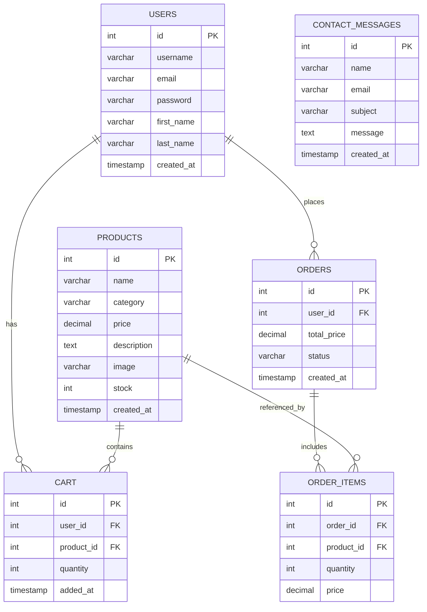
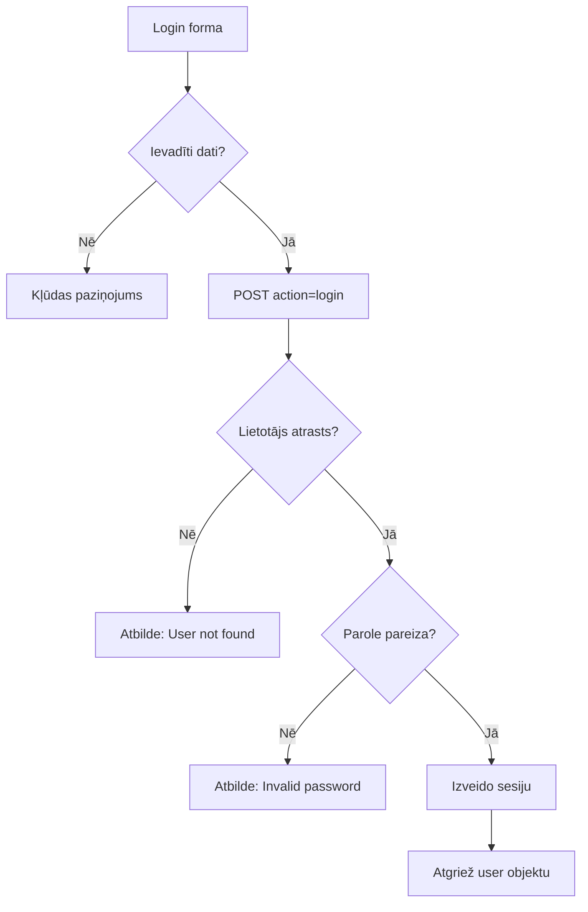
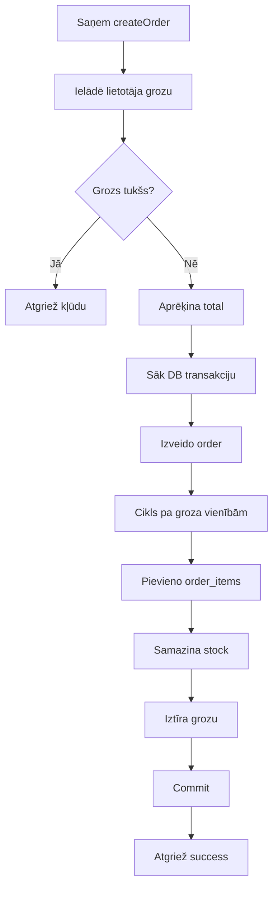
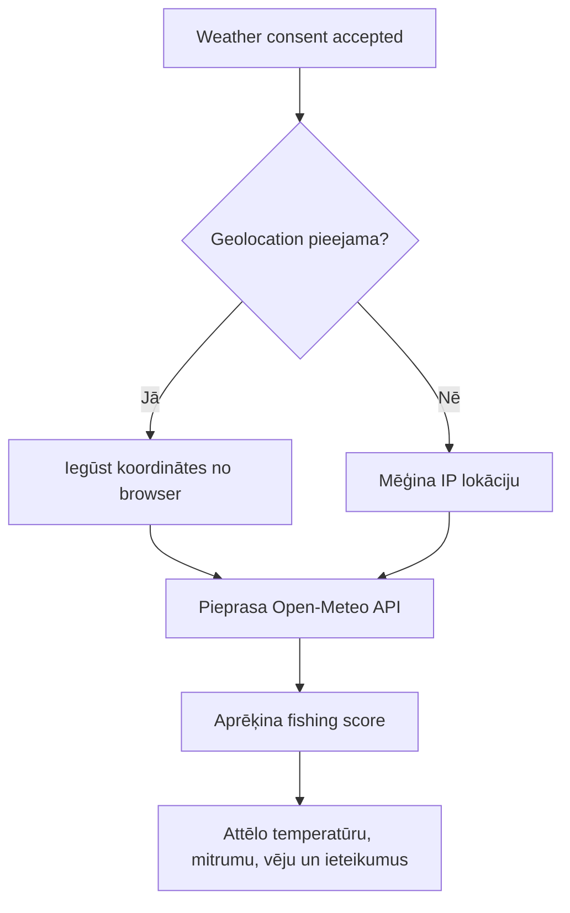

# FishingGear Pro kvalifikācijas darba dokumentācija

## 1. Ievads

Digitālās komercijas attīstība būtiski maina mazumtirdzniecības nozari, tai skaitā arī makšķerlietu tirgu. Tradicionālā pirkšanas pieeja (fiziska veikala apmeklējums) ne vienmēr nodrošina lietotājam ātru produktu salīdzināšanu, cenu pārskatāmību un ērtu piekļuvi precēm jebkurā laikā. Tāpēc pieaug nepieciešamība pēc specializētas e-komercijas platformas, kas fokusēta tieši uz makšķerēšanas inventāru.

Projekts **FishingGear Pro** risina šo problēmu, piedāvājot tīmekļa vidi produktu pārlūkošanai, filtrēšanai, lietotāju autentifikācijai, groza pārvaldībai un administratora pārvaldības darbībām. Papildus komercijas funkcionalitātei sistēmā ir iekļauta laikapstākļu sadaļa sākumlapā (temperatūra, vēja ātrums, mitrums), kas tiek izmantota makšķerēšanas apstākļu novērtējumam.

Produkta aktualitāti nosaka:
- pieprasījums pēc nišas e-komercijas risinājumiem;
- lietotāju vēlme saņemt personalizētu un kontekstā balstītu informāciju;
- nepieciešamība digitalizēt produktu pārvaldību (administratora panelis);
- iespēja nākotnē paplašināt sistēmu ar pilnvērtīgu checkout un maksājumu integrācijām.

### SVID analīze

| Faktors | Apraksts |
|---|---|
| **Stiprās puses** | React frontend, PHP API, MySQL datu modelis, administratora funkcijas, laikapstākļu integrācija lietotājam. |
| **Vājās puses** | Frontend grozs ir lokāls (`localStorage`) un pašlaik nav pilnībā sasaistīts ar backend pasūtījuma izveides plūsmu. |
| **Iespējas** | Maksājumu sistēmu integrācija, pasūtījuma statusu paplašināšana, analītika, produktu attēlu glabāšana CDN. |
| **Draudi** | Drošības riski publiskai izvietošanai, ārējo API (laikapstākļi) pieejamība, datu apjoma pieauguma ietekme uz veiktspēju. |

---

## 2. Uzdevuma formulējums

### 2.1. Produkta nosaukums un veids
- **Nosaukums:** FishingGear Pro
- **Veids:** makšķerlietu e-komercijas tīmekļa lietotne (SPA frontend + PHP API backend)

### 2.2. Mērķis
Izstrādāt lietotājam ērtu un responsīvu tīmekļa sistēmu makšķerlietu pārlūkošanai un pārvaldībai, nodrošinot autentifikāciju, grozu, saziņas formu, administratora pārvaldību un laikapstākļu informācijas attēlošanu sākumlapā.

### 2.3. Pamatlietotāju grupas, tiesības un iespējas
- **Viesis (neautentificēts lietotājs):** var pārlūkot produktus, meklēt, filtrēt, skatīt produktu kartītes, aizpildīt kontaktformu un izmantot frontend grozu (`localStorage`).
- **Autentificēts lietotājs:** var pieslēgties/izrakstīties, izmantot sesiju (`getCurrentUser`) un piekļūt lietotāja endpointiem (piem., pasūtījumu izgūšana API līmenī).
- **Administrators:** var pievienot, rediģēt, dzēst produktus un atzīmēt preces kā izpārdotas (administratora pārbaude balstīta uz lietotājvārdu `Ippijs`).

### 2.4. Realizācijai nepieciešamie sistēmas elementi
- React frontend (`Frontend/src/*`)
- PHP API ieejas punkts (`api.php`)
- Backend moduļi: autentifikācija, produkti, grozs, pasūtījumi, kontakti (`Backend/*.php`)
- MySQL datubāze (`Backend/KvalDB.sql`)
- Ārējais laikapstākļu serviss (`api.open-meteo.com`), ar atrašanās vietas iegūšanu no pārlūka vai IP fallback.

### 2.5. Pamatuzdevumi sistēmā
- produktu saraksta un detaļu apskate;
- produktu meklēšana/filtrēšana pēc kategorijām;
- lietotāja reģistrācija un pieslēgšanās;
- groza pārvaldība;
- administratora produktu pārvaldība;
- kontaktziņojuma nosūtīšana;
- laikapstākļu un makšķerēšanas apstākļu attēlošana sākumlapā.

### 2.6. Darbības vides prasības
- OS: Windows/Linux/macOS (attīstībai)
- Serveris: Apache + PHP (XAMPP)
- Datubāze: MySQL
- Frontend: Node.js + npm, Vite
- Pārlūki: moderni pārlūki ar JavaScript atbalstu
- Responsivitāte: mobilās, planšetes un desktop ierīces (CSS breakpoints projektā)

### 2.7. Pieejamības nodrošināšana
- Lietotne pieejama tīmeklī (nav nepieciešama atsevišķa instalācija gala lietotājam).
- Izstrādes režīmā frontend darbojas `localhost:5173`, backend `localhost/KvalDarbs/api.php`.

---

## 3. Prasību specifikācija

### 3.1. Sistēmas funkcionālās prasības

| ID | Funkcionālā prasība | Ieeja | Apstrāde | Rezultāts |
|---|---|---|---|---|
| FR-01 | Sistēma ielādē produktu sarakstu ar lapošanu | `page`, `category`, `search` | `getProducts` izsauc `get_all_products` | Atgriezts JSON ar produktiem un lapas info |
| FR-02 | Lietotājs var apskatīt konkrētu produktu | `id` | API `getProduct` izgūst produktu pēc ID | Attēlota produkta detaļlapa |
| FR-03 | Lietotājs var reģistrēties un pieslēgties | `username`, `email`, `password` | `register`/`login`, paroles hash/verify | Izveidots konts vai aktīva sesija |
| FR-04 | Administrators var pārvaldīt produktus | produkta dati | API: `createProduct`, `updateProduct`, `deleteProduct`, `setSoldOut` | Produkts pievienots/labots/dzēsts/atzīmēts kā izpārdots |
| FR-05 | Lietotājs var nosūtīt kontaktziņu | `name`, `email`, `message` | `sendContactMessage` saglabā DB | Ziņa saglabāta `contact_messages` tabulā |
| FR-06 | Sistēma rāda laikapstākļu datus | atrašanās vieta vai IP | Pieprasījums uz Open-Meteo API un datu aprēķins | Attēlota temperatūra, mitrums, vējš, ieteikumi |
| FR-07 | Grozs glabā izvēlētās preces frontend pusē | produkts, daudzums | `useCart` darbība ar `localStorage` | Saglabāts un attēlots grozs |

### 3.2. Sistēmas nefunkcionālās prasības

| ID | Prasību grupa | Prasība |
|---|---|---|
| NFR-01 | Veiktspēja | Produktu ielāde jāveic saprātīgā laikā (tipiski <2 s lokālā vidē). |
| NFR-02 | Drošība | Paroles glabāt hash veidā (`password_hash`, bcrypt). |
| NFR-03 | Uzticamība | Kļūdu gadījumos frontend rāda lietotājam saprotamus paziņojumus (Alert). |
| NFR-04 | Saskarne | UI jābūt responsīvam dažādiem ekrānu izmēriem. |
| NFR-05 | Savietojamība | Sistēma darbojas ar React + PHP + MySQL steku lokālā servera vidē. |
| NFR-06 | Datu noturība | Galvenie biznesa dati glabājas MySQL datubāzē (produkti, lietotāji, pasūtījumi, ziņas). |
| NFR-07 | Lokalizācija | Sistēma atbalsta EN/LV valodu pārslēgšanu frontend līmenī. |

---

## 4. Uzdevuma risināšanas līdzekļu apraksts un izvēles pamatojums

### 4.1. Iespējamo risinājuma līdzekļu un valodu apraksts

#### Frontend alternatīvas
1. **React** — komponentu pieeja, plaša ekosistēma, SPA arhitektūra.
2. **Vue.js** — viegli apgūstams, laba reaktivitāte un vienkārša integrācija.
3. **Angular** — pilns framework ar stingru struktūru, piemērots lielām sistēmām.

#### Backend alternatīvas
1. **PHP** — tradicionāli izplatīts tīmekļa backend risinājums, vienkārša izvietošana uz Apache/XAMPP.
2. **Node.js (Express)** — vienota JavaScript vide frontend/backend daļai.
3. **Python (Django/Flask)** — ātra izstrāde, ērta ORM izmantošana.

#### Datubāzes alternatīvas
1. **MySQL** — relāciju DB ar plašu hostinga atbalstu.
2. **PostgreSQL** — paplašināta SQL funkcionalitāte.
3. **SQLite** — viegls risinājums lokāliem vai mazākiem projektiem.

#### Papildu rīku alternatīvas
1. **Vite** (ātrs frontend build/dev serveris)
2. **Webpack** (elastīgs, bet konfigurējami sarežģītāks)
3. **Parcel** (vienkārša konfigurācija nelieliem projektiem)

### 4.2. Izvēlēto risinājuma līdzekļu un valodu apraksts un pamatojums

Projektā izvēlēts steks: **React + PHP + MySQL + Vite + Axios**.

Pamatojums:
- React nodrošina modulāru UI un ērtu lapu/komponentu sadalījumu.
- PHP backend ir viegli uzturams XAMPP vidē un atbilst esošajam projekta kodam.
- MySQL nodrošina relāciju modeli e-komercijas datiem.
- Vite paātrina izstrādes ciklu un build procesu.
- Axios vienkāršo API pieprasījumu pārvaldību ar `withCredentials` sesiju darbībai.

---

## 5. Sistēmas modelēšana un projektēšana

### 5.1. Sistēmas struktūras modelis

#### 5.1.1. Produkta struktūra
- `Frontend/` — React SPA (lapas, komponentes, API klients, stili)
- `Backend/` — biznesa loģika (auth, products, cart, orders, contact, config)
- `api.php` — maršrutē API darbības pēc `action`
- `Backend/KvalDB.sql` — datubāzes shēma un sākotnējie dati

#### 5.1.2. ER modelis (teksts + Mermaid)

**Tekstuāls apraksts:**
- `users` 1:N `orders`
- `users` 1:N `cart`
- `products` 1:N `cart`
- `orders` 1:N `order_items`
- `products` 1:N `order_items`
- `contact_messages` ir neatkarīga tabula ienākošajām ziņām

#### 5.1.3. Datu vārdnīca (saīsināti)

| Entītija | Lauks | Tips | Paskaidrojums |
|---|---|---|---|
| users | username | VARCHAR(50) | unikāls lietotājvārds |
| users | password | VARCHAR(255) | paroles hash |
| products | category | VARCHAR(50) | preces kategorija |
| products | stock | INT | pieejamais daudzums |
| cart | quantity | INT | preces daudzums grozā |
| orders | total_price | DECIMAL(10,2) | pasūtījuma summa |
| order_items | price | DECIMAL(10,2) | vienības cena pirkuma brīdī |
| contact_messages | message | TEXT | lietotāja ziņojuma saturs |

### 5.2. Funkcionālais un dinamiskais sistēmas modelis

#### 5.2.1. Lietojuma gadījumu scenāriji

**Scenārijs A — Reģistrācija un pieslēgšanās**
1. Lietotājs atver reģistrācijas formu.
2. Ievada lietotājvārdu, e-pastu, paroli.
3. Frontend validē paroles noteikumus.
4. API izpilda `register`, saglabā lietotāju DB.
5. Lietotājs dodas uz login un autorizējas (`login`).

**Scenārijs B — Produkta pievienošana grozam**
1. Lietotājs atver produktu sarakstu vai detaļlapu.
2. Izvēlas daudzumu.
3. Frontend pievieno produktu grozam (`localStorage`).
4. Lietotājs redz atjauninātu groza saturu un summu.

**Scenārijs C — Administratora produktu pārvaldība**
1. Administrators autorizējas.
2. Atver `/admin` skatu.
3. Veic pievienošanu/labošanu/dzēšanu/atzīmēšanu kā izpārdots.
4. Frontend izsauc attiecīgo API action.
5. Saraksts tiek pārlādēts ar jaunajiem datiem.

#### 5.2.2. Algoritmu shēmas

**A) Autentifikācijas plūsma**

**B) Pirkuma/pasūtījuma backend plūsma (`createOrder`)**

**C) Laikapstākļu iegūšanas plūsma**

---

## 6. Lietotāja ceļvedis

### 6.1. Produktu apskate un filtrēšana
**Mērķis:** atrast vajadzīgo produktu kategorijā.

**Soļi:**
1. Atvērt sākumlapu.
2. Spiest “Shop All Products”.
3. Kreisajā izvēlnē izvēlēties kategoriju.
4. Izmantot meklēšanu un apakšfiltrus.
5. Atvērt produktu detaļlapu.

**Ekrānuzņēmuma atsauce:** Attēls 1 (produktu saraksts), Attēls 2 (filtri).

### 6.2. Reģistrācija
**Mērķis:** izveidot jaunu lietotāja kontu.

**Soļi:**
1. Atvērt “Register”.
2. Aizpildīt lietotājvārdu, e-pastu, paroli, paroles apstiprinājumu.
3. Ievērot paroles prasības (garums, lielais burts, speciālais simbols).
4. Nosūtīt formu.
5. Pēc veiksmīgas reģistrācijas pāriet uz login lapu.

**Ekrānuzņēmuma atsauce:** Attēls 3 (reģistrācijas forma).

### 6.3. Pieslēgšanās
**Mērķis:** autorizēties sistēmā.

**Soļi:**
1. Atvērt “Login”.
2. Ievadīt lietotājvārdu un paroli.
3. Spiest “Log In”.
4. Sagaidīt API atbildi.
5. Veiksmīga pieslēgšanās novirza uz sākumlapu.

**Ekrānuzņēmuma atsauce:** Attēls 4 (login forma).

### 6.4. Groza lietošana
**Mērķis:** pievienot un pārvaldīt preces grozā.

**Soļi:**
1. Atvērt produktu un izvēlēties daudzumu.
2. Spiest “Add to cart”.
3. Atvērt groza lapu.
4. Pārskatīt summu un vienības.
5. Vajadzības gadījumā dzēst preces vai turpināt iepirkšanos.

**Ekrānuzņēmuma atsauce:** Attēls 5 (produkta detaļlapa), Attēls 6 (grozs).

### 6.5. Administratora darbības
**Mērķis:** pārvaldīt produktu katalogu.

**Soļi:**
1. Pieslēgties ar admin kontu.
2. Atvērt admin paneli (`/admin`).
3. Pievienot vai rediģēt produktu formā.
4. Dzēst produktu vai atzīmēt kā “Sold Out”.
5. Pārbaudīt atjauninātu produktu sarakstu.

**Ekrānuzņēmuma atsauce:** Attēls 7 (admin panelis).

### 6.6. Laikapstākļu bloka izmantošana
**Mērķis:** skatīt aktuālos laikapstākļus un makšķerēšanas ieteikumus.

**Soļi:**
1. Atvērt sākumlapu.
2. Piekrist atrašanās vietas piekļuvei uznirstošajā logā.
3. Sagaidīt laikapstākļu datu ielādi.
4. Nolasīt temperatūru, mitrumu un vēju.
5. Izmantot “best fish today” rekomendācijas.

**Ekrānuzņēmuma atsauce:** Attēls 8 (weather/fishing conditions panelis).

---

## 7. Testa piemēri

| Tests | Testa veids un mērķis | Soļi | Paredzamais rezultāts | Reālais rezultāts | Secinājums |
|---|---|---|---|---|---|
| T-01 | Funkcionālais: lietotāja reģistrācija | Atvērt Register, ievadīt derīgus datus, nosūtīt formu | Lietotājs tiek izveidots, parādās veiksmes ziņa, iespējams login | Reģistrācija veiksmīga ar `success=true` | Prasība FR-03 izpildīta |
| T-02 | Funkcionālais: produktu filtrēšana | Atvērt veikalu, izvēlēties kategoriju, lietot meklēšanu | Tiek attēloti tikai atbilstošie produkti | Filtri un meklēšana darbojas | Prasība FR-01 izpildīta |
| T-03 | Integrācijas: laikapstākļu dati sākumlapā | Piešķirt weather consent, ļaut lokāciju | Parādās temperatūra, mitrums, vējš un ieteikumi | Dati ielādējas no Open-Meteo, panelis redzams | Prasība FR-06 izpildīta |

Papildu validācija izstrādes laikā:
- Frontend build (`npm run build`) — sekmīgs.
- PHP sintakses pārbaude (`php -l`) — kļūdu nav.

---

## 8. Secinājumi

Izstrādāts un dokumentēts makšķerlietu e-komercijas risinājums ar React frontend, PHP backend un MySQL datubāzi. Sistēma nodrošina pamatfunkcijas: produktu pārvaldību, lietotāju autentifikāciju, groza darbību, kontaktziņojumus, administratora paneli un laikapstākļu informāciju.

Galvenie izaicinājumi:
- sinhronizēt dažādu slāņu (frontend/backend/DB) prasības;
- uzturēt vienotu datu modeli starp API un saskarni;
- nodrošināt lietotājam saprotamu plūsmu un paziņojumus.

Nākotnes uzlabojumi:
- pilna checkout UI ieviešana ar backend `createOrder` pilnvērtīgu izmantošanu;
- maksājumu sistēmu integrācija;
- pasūtījumu statusu paplašināšana (pending/paid/shipped/delivered);
- paplašināta auditēšana un drošības kontroles publiskai videi.

---

## 9. Saīsinājumu saraksts / Terminu vārdnīca

| Termins | Nozīme |
|---|---|
| API | Lietojumprogrammas saskarne datu apmaiņai starp frontend un backend |
| SPA | Single Page Application — vienlapas tīmekļa lietotne |
| UI | Lietotāja saskarne |
| UX | Lietotāja pieredze |
| DB | Datubāze |
| CRUD | Create, Read, Update, Delete datu operācijas |
| CORS | Cross-Origin Resource Sharing |
| Session | Servera sesijas stāvoklis autentifikācijas uzturēšanai |
| ER diagramma | Entītiju-attiecību datu modelis |
| Vite | Frontend izstrādes/build rīks |

---

## 10. Informācijas avotu saraksts

1. Repozitorija kods un faili:
   - `README.md`
   - `api.php`
   - `Backend/KvalDB.sql`
   - `Backend/auth.php`
   - `Backend/products.php`
   - `Backend/cart.php`
   - `Backend/orders.php`
   - `Backend/contact.php`
   - `Frontend/src/App.jsx`
   - `Frontend/src/pages/HomeLanding.jsx`
   - `Frontend/src/pages/Home.jsx`
   - `Frontend/src/pages/Product.jsx`
   - `Frontend/src/pages/Cart.jsx`
   - `Frontend/src/pages/Admin.jsx`
   - `Frontend/src/pages/Login.jsx`
   - `Frontend/src/pages/Register.jsx`
   - `Frontend/src/pages/Contact.jsx`
   - `Frontend/src/api/client.js`
   - `Frontend/src/api/useAuth.js`
   - `Frontend/src/api/useCart.js`
2. Open-Meteo API dokumentācija: https://open-meteo.com/
3. React dokumentācija: https://react.dev/
4. PHP dokumentācija: https://www.php.net/docs.php
5. MySQL dokumentācija: https://dev.mysql.com/doc/

---

## 11. Pielikumi

### 11.1. Galveno failu uzskaitījums

- `api.php` — centralizēts API maršrutētājs
- `Backend/config.php` — DB pieslēgums
- `Backend/auth.php` — autentifikācijas funkcijas
- `Backend/products.php` — produktu vaicājumi un CRUD
- `Backend/cart.php` — groza darbības DB līmenī
- `Backend/orders.php` — pasūtījumu izveide un izgūšana
- `Backend/contact.php` — kontaktziņojumu saglabāšana
- `Backend/KvalDB.sql` — datubāzes struktūra un sākotnējie dati
- `Frontend/src/App.jsx` — maršrutēšana un globālais stāvoklis
- `Frontend/src/pages/*` — lietotāja un admin lapas
- `Frontend/src/api/client.js` — frontend API slānis

### 11.2. API endpointu saraksts (`api.php?action=...`)

| Endpoint | Metode | Pieeja |
|---|---|---|
| getProducts | GET | publiska |
| getProduct | GET | publiska |
| getCategories | GET | publiska |
| getAllProductsAdmin | GET | tikai admin |
| createProduct | POST | tikai admin |
| updateProduct | POST | tikai admin |
| deleteProduct | POST | tikai admin |
| setSoldOut | POST | tikai admin |
| getCart | GET | autentificēts lietotājs |
| addToCart | POST | autentificēts lietotājs |
| removeFromCart | POST | autentificēts lietotājs |
| updateCartItem | POST | autentificēts lietotājs |
| login | POST | publiska |
| register | POST | publiska |
| getCurrentUser | GET | autentificēts lietotājs |
| logout | POST | autentificēts lietotājs |
| getOrders | GET | autentificēts lietotājs |
| createOrder | POST | autentificēts lietotājs |
| sendContactMessage | POST | publiska |

### 11.3. Algoritmu un diagrammu pielikuma atsauces

- A pielikums: ER diagramma (`5.1.2`)
- B pielikums: Autentifikācijas plūsmas diagramma (`5.2.2`)
- C pielikums: Pasūtījuma plūsmas diagramma (`5.2.2`)
- D pielikums: Laikapstākļu plūsmas diagramma (`5.2.2`)
